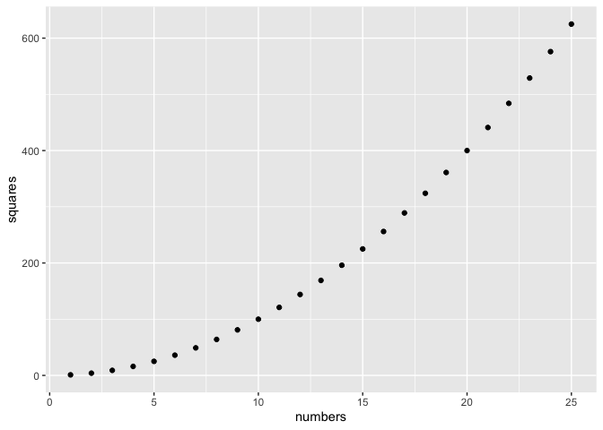
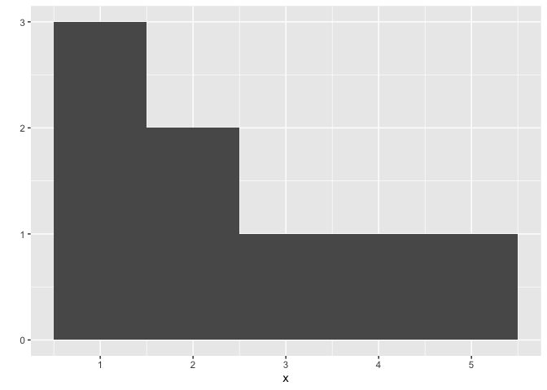
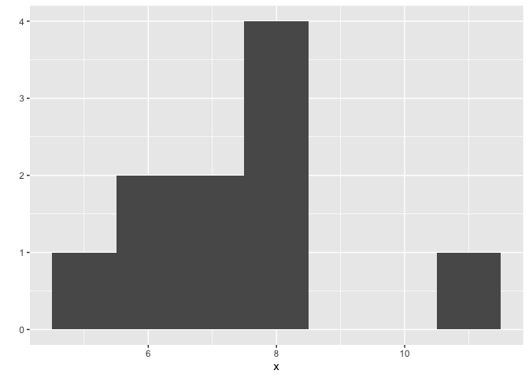
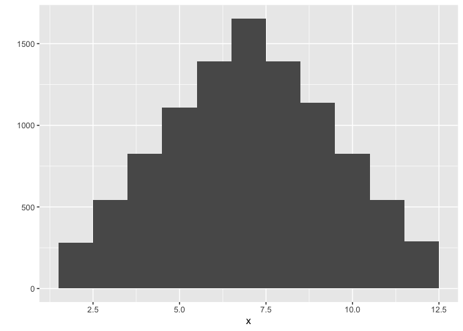
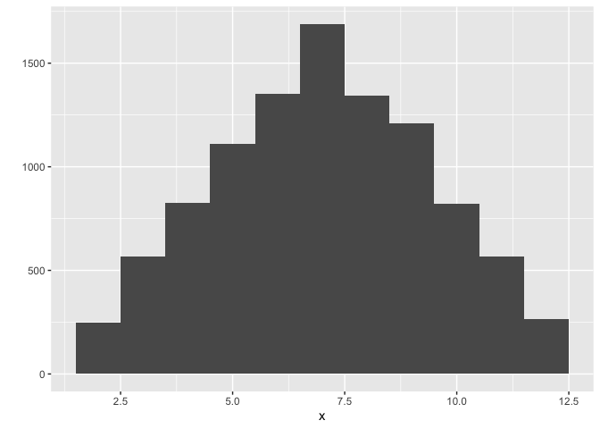
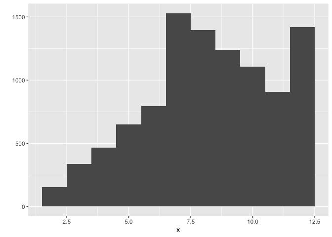

Untitled
================

## Install Packages

``` r
# install.packages("ggplot2")
```

## Load Packages

``` r
library("ggplot2")
```

``` r
# scatterplot
numbers <- 1:25
squares <- numbers ^ 2

qplot(x = numbers, y = squares)
```

<!-- -->

``` r
# histogram
x <- c(1, 1, 1, 2, 2, 5, 3, 4)
qplot(x, binwidth = 1)
```

<!-- -->

## Repetition and Visualization

``` r
roll <- function() {
  die <- 1:6
  dice <- sample(x = die, size = 2, replace = TRUE)
  sum(dice)
}
```

### ‘replicate’

``` r
x <- replicate(n = 10, expr = roll())
qplot(x, binwidth = 1)
```

<!-- -->

``` r
x <- replicate(n = 10000, expr = roll())
qplot(x, binwidth = 1)
```

<!-- -->

### Weighted roll

``` r
weighted_roll <- function() {
  die <- 1:6
  
  dice <- sample(
    x = die,
    size = 2, 
    replace = TRUE,
    prob = c(0.1, 0.1, 0.1, 0.1, 0.1, 0.3)
  )
  
  sum(dice)
}

x <- replicate(n = 10000, expr = roll())
qplot(x, binwidth = 1)
```

<!-- -->

``` r
x <- replicate(n = 10000, expr = weighted_roll())
qplot(x, binwidth = 1)
```

<!-- -->

## Help

``` r
?round
```
